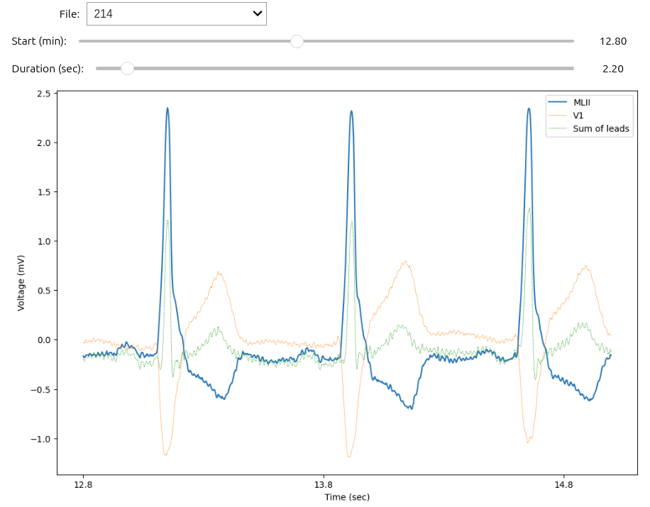
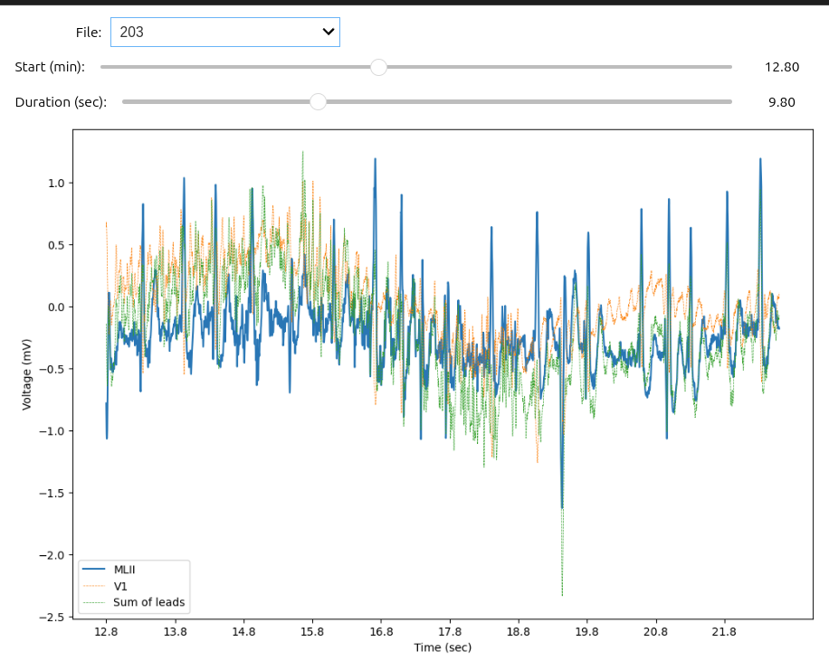

# ECG-Analysis

Data Description and Summary:

48 half-hour portions of two-channel ambulatory ECG recordings from 47 patients examined by the BIH Arrhythmia Laboratory between 1975 and 1979 are available in the MIT-BIH Arrhythmia Database. Two hundred and twenty-three recordings were randomly selected from a set of four thousand twenty-hour ambulatory ECG recordings obtained from a mixed population of patients at Boston's Beth Israel Hospital, comprising approximately sixty percent outpatients and forty percent inpatients. The remaining twenty-five recordings were chosen from the same set to include less common, but clinically significant, arrhythmias that would not be well-represented in a small random sample.

Over a 10 mV range, the recordings were digitized at 360 samples per second per channel with 11-bit resolution. Each record was separately annotated by two or more cardiologists; differences were settled to produce computer-readable reference annotations for every beat (about 110,000 annotations total) that are included in the database.

Number of Records: 12

Measurements per Record: 650,000

Sampling Frequency: 
The sampling frequency of the ECG signals is 360 Hz.

Annotations and Symbols: 
The annotations in the MIT-BIH Arrhythmia Database indicate various types of cardiac events, including normal beats and different types of arrhythmias. The symbols used in annotations and their meanings include:

N: Normal beat, 
L: Left bundle branch block beat,
R: Right bundle branch block beat,
A: Atrial premature beat,
V: Premature ventricular contraction,
S: Premature or ectopic supraventricular beat,
T: T-wave change,
/: Non-conducted P-wave (blocked APC), Paced beat,
~: Signal quality change,
|: Isolated QRS-like artifact,
s: ST change,
f: Fusion of ventricular and normal beat,
F: Fusion of paced and normal beat,
J: Nodal (junctional) escape beat,
E: Atrial escape beat,
Q: Unclassifiable beat,
?: Beat not classified during learning.

I created a  function called record_reader that receives a path to a folder that contains a list of ECG records (hea files), and returns a list of dictionaries containing the record files and the corresponding WFDB Record and WFDB Annotation objects.
 Some visualisations from the dataset are 

